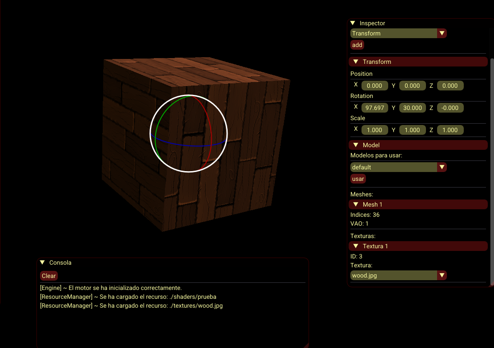
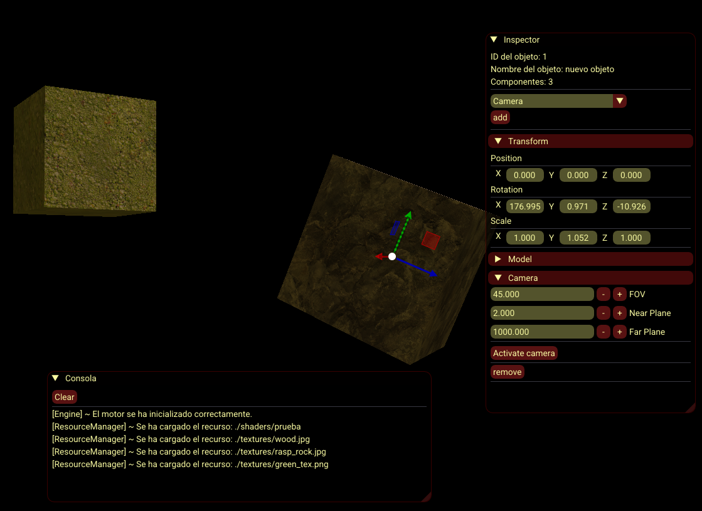
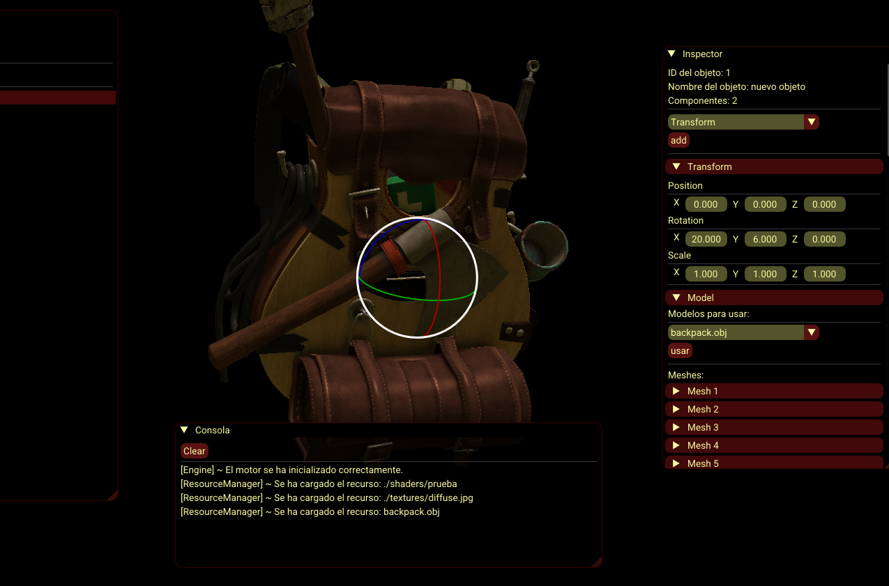
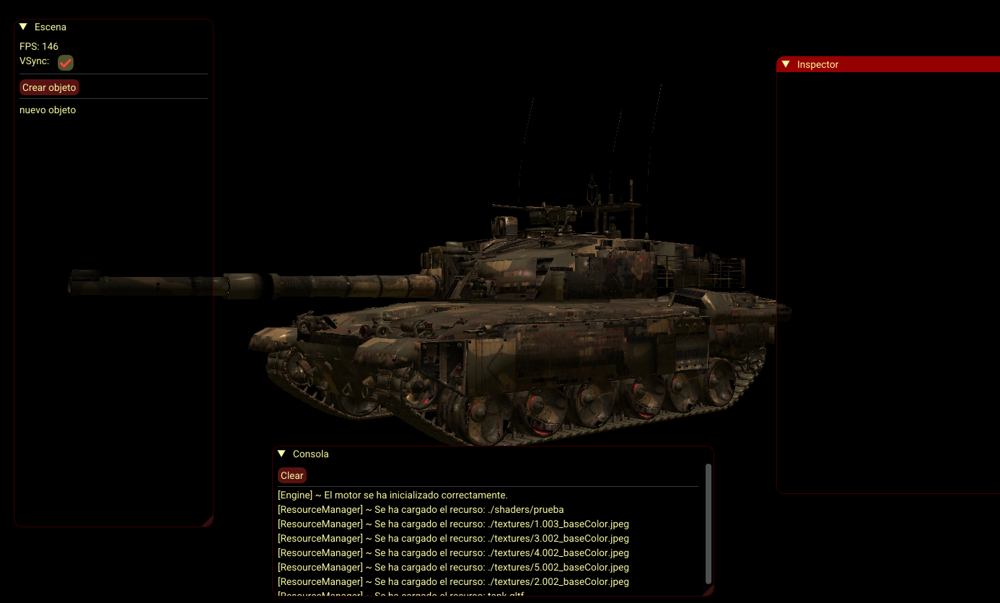
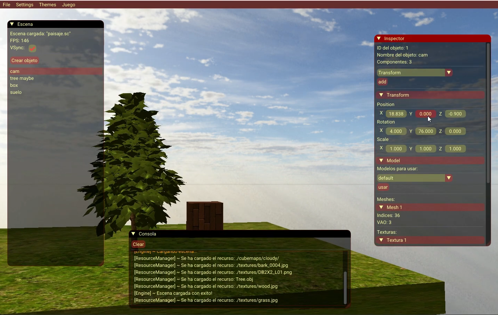
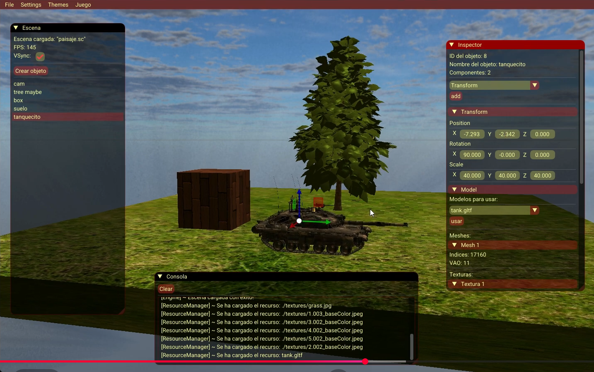
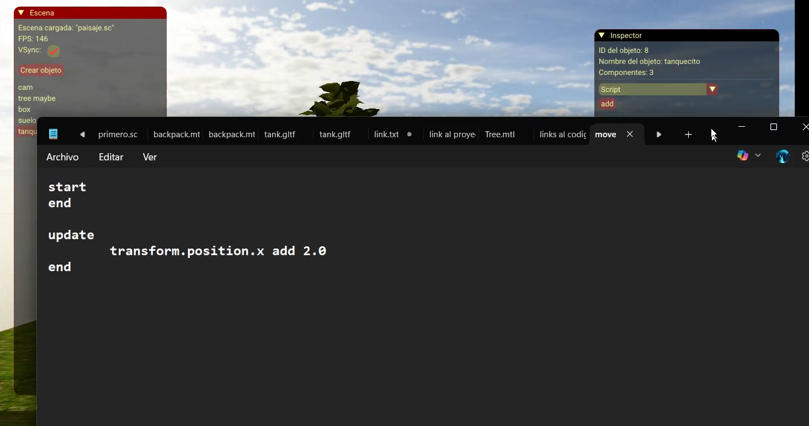

<h1 align="center">Serlliber Engine: <br>3D Graphics Engine in C++ & OpenGL</h1>
<p align="center"><a href="#project-description">Project Description</a> - <a href="#features">Features</a> - <a href="#tech-stack">Tech Stack</a> - <a href="#installation">Installation</a> - <a href="#screenshots">Screenshots</a></p>

<p align="center">
  
</p>

## Project Description:

<p><strong>Serlliber Engine</strong> is a prototype 3D graphics engine developed in <strong>C++</strong> using <strong>OpenGL</strong> and <strong>ImGui</strong> for the interface. It allows users to create and manipulate 3D scenes with a variety of features, including:</p>

## Features:
<ul style="text-align: left; display: inline-block;">
  <li><strong>Customizable Skyboxes</strong> to set the background environment of your scenes.</li>
  <li><strong>Model Importing</strong>: Load and use 3D models with ease.</li>
  <li><strong>Texture Management</strong>: Change textures of models dynamically.</li>
  <li><strong>Basic Phong Lighting</strong> for realistic illumination of objects.</li>
  <li><strong>Simple Scripting Language</strong> to interact with objects and control scene behavior.</li>
  <li><strong>User Interface Themes</strong> via ImGui, allowing personalization of the editor layout.</li>
</ul>

<p>This project is my <strong>first graphics engine</strong>, serving as a functional prototype. While not fully complete, it demonstrates <strong>core engine concepts</strong>, scene management, rendering techniques, and interface integration. It reflects hands-on experience with <strong>low-level graphics programming</strong> and engine architecture.</p>

## Tech Stack:
<ul style="text-align: left; display: inline-block;">
  <li>Languages: C++, GLSL (OpenGL Shading Language), JSON.</li>
  <li>Libraries: GLAD, GLFW, GLM, ImGui, Assimp, nlohmann JSON.</li>
  <li>Tools: Git, Visual Studio, CMake.</li>
</ul>

## Installation:
1. Clone the repository:
```bash 
  git clone https://github.com/tuusuario/tu-repo.git](https://github.com/danielblazquez916/3d-engine-cpp.git
```
2. Open the .sln file in Visual Studio.
3. Select Debug or Release mode.
4. Press <kbd>F5</kbd> or click Start Debugging to launch the engine.

- If you want to compile the code in an IDE other than Visual Studio, you’ll need to use CMake to generate the appropriate project files for your IDE.
However, my recommendation is to use Visual Studio to run the engine!

## Screenshots:
<p align="center">   </p> <p align="center">   </p> <p align="center">   </p> <p align="center">  </p>
